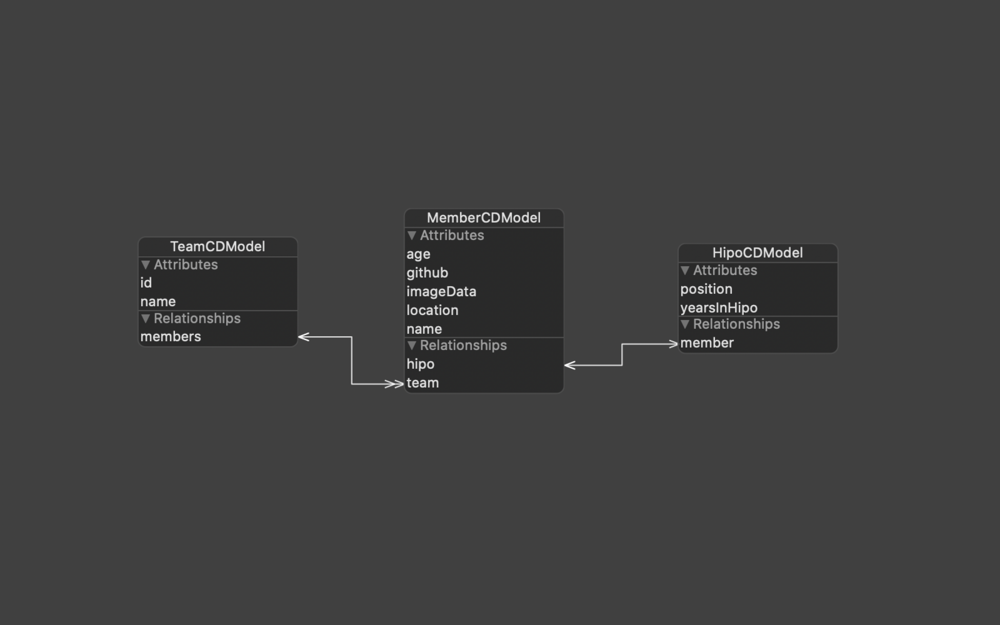

# HSIA

> This project was made within "Hipo Summer Internship Application".

⚠️ When using the application in the simulator, UIImagePickerController will open slowly. To avoid this problem, test on a real device.
**[Stack Overflow](https://stackoverflow.com/questions/20353492/uiimagepickercontroller-really-slow-when-calling-alloc-init)**

## Code

### Data Storage

UserDefaults and CoreData were used to store data in the project. UserDefaults was used to control the first launch of the application. CoreData is used to store Team and Member information. There is a one-to-many relationship between Team and Member. There is a one-to-one relationship between Member and Hipo.

<p align="center">
 
 <br />
 CoreData Model
</p>

#### CRUD in CoreData for Member

##### Create

```swift
func createMember(image: UIImage?, teamId: Int16, name: String, github: String, age: Int16, location: String, position: String, yearsInHipo: Int16) -> MemberCDModel {
    let member = MemberCDModel(context: context)
    
    if let image = image {
        member.imageData = image.jpegData(compressionQuality: 0.5)
    }
    member.team = fetchTeam(id: teamId)
    member.name = name
    member.github = github
    member.age = age
    member.location = location
    
    let hipo = HipoCDModel(context: context)
    hipo.position = position
    hipo.yearsInHipo = yearsInHipo
    
    member.hipo = hipo
    
    saveContext()
    
    return member
}
```

##### Read

```swift
func fetchMembers() -> [MemberCDModel] {
    let fetchRequest: NSFetchRequest<MemberCDModel> = MemberCDModel.fetchRequest()
    do {
        let members = try context.fetch(fetchRequest)
        return members
    } catch let fetchErr {
        print("Failed to fetch:", fetchErr)
        return []
    }
}
```

##### Update

```swift
func updateMember(member: MemberCDModel, image: UIImage?, teamId: Int16, name: String, github: String, age: Int16, location: String, position: String, yearsInHipo: Int16) {
    if let image = image {
        member.imageData = image.jpegData(compressionQuality: 0.5)
    }
    member.team = fetchTeam(id: teamId)
    member.name = name
    member.github = github
    member.age = age
    member.location = location
    member.hipo?.position = position
    member.hipo?.yearsInHipo = yearsInHipo
    
    saveContext()
}
```

##### Delete

```swift
func deleteMember(member: MemberCDModel) {
    context.delete(member)
    saveContext()
}
```

### Sorting

**Rules**
<br />
1- By using the extension function you wrote, find the most occurences of the character for each string in the array and sort in descending order.
<br />
2- If two or more strings contain the same amount for the character, sort these according to their length.
<br />
3- If two or more strings contain the same amount for the character and have the same length, sort these in alphabetical order.

```swift
fileprivate func sort(members: [MemberCDModel], character: String) -> [MemberCDModel] {
    var sortedArr = members
    sortedArr.sort(by: {
        let lastName1 = $0.name?.findLastName() ?? ""
        let lastName2 = $1.name?.findLastName() ?? ""
        if lastName1.countNumberOfOccurrencesOfCharacter(char: character) != lastName2.countNumberOfOccurrencesOfCharacter(char: character) {
            return lastName1.countNumberOfOccurrencesOfCharacter(char: character) > lastName2.countNumberOfOccurrencesOfCharacter(char: character)
        } else if lastName1.count != lastName2.count {
            return lastName1.count > lastName2.count
        } else {
            return lastName1 < lastName2
        }
    })
    return sortedArr
}
```

## Architecture

MVC architecture was used in this project.

## Auto Layout

NSLayoutConstraint and LBTATools are used for AutoLayout.

## Compatibility

Requires iOS 11.0 or later. Compatible with iPhone.

## Third Party Libraries

> Added via Swift Package Manager.

- **[LBTATools](https://github.com/bhlvoong/LBTATools)**

## Design System

The given template has been generally applied. Some additions have been made. In this context, a small Design System was created for the project. Designed using the Sketch.

- **[HSIADesignSystem](https://www.sketch.com/s/7cbb4b7b-a494-4fe4-bedf-132b5bd3a8d7)**
